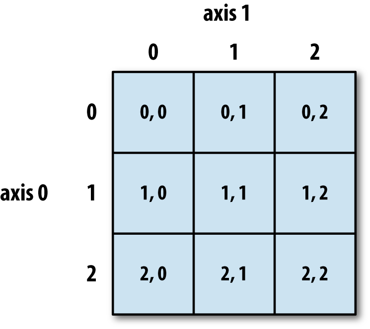
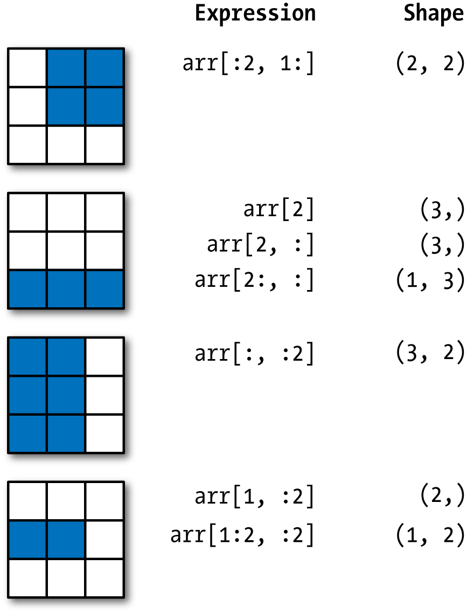

## Introduction to NumPy

### Introduction
NumPy, short for Numerical Python, is one of the most important foundational packages for numerical computing in Python. Many computational packages providing scientific functionality use NumPy's array objects as one of the standard interfaces lingua franca for data exchange.

Here are some of the things you'll find in NumPy:

- ndarray, an efficient multidimensional array providing fast array-oriented arithmetic operations and flexible broadcasting capabilities.

- Mathematical functions for fast operations on entire arrays of data without having to write loops.

- Tools for reading/writing array data to disk and working with memory-mapped files.

- Linear algebra, random number generation, and Fourier transform capabilities.

- A C API for connecting NumPy with libraries written in C, C++, or FORTRAN.

While NumPy provides a computational foundation for general numerical data processing, many readers will want to use pandas as the basis for most kinds of statistics or analytics, especially on tabular data. pandas also provides some more domain-specific functionality like time series manipulation, which is not present in NumPy.

### Performance

One of the reasons NumPy is so important for numerical computations in Python is because it is designed for efficiency on large arrays of data

To give you an idea of the performance difference, consider a NumPy array of one million integers, and the equivalent Python list. Let's multiply each sequence by 2:

```python
import numpy as np
arr1 = np.arange(1000000)
l1 = list(range(1000000))

%time arr2 = arr1*2
%time l2 = [x * 2 for x in l1]
```

### The NumPy ndarray

One of the key features of NumPy is its N-dimensional array object, or ndarray, which is a fast, flexible container for large datasets in Python. Arrays enable you to perform mathematical operations on whole blocks of data using similar syntax to the equivalent operations between scalar elements.

Let's generate a small array of random data:

```python
(data := np.random.randn(3, 4))
data * 10
data + data
```

An ndarray is a generic multidimensional container for homogeneous data; that is, all of the elements must be the same type. Every array has a shape, a tuple indicating the size of each dimension, and a dtype, an object describing the data type of the array

```python
data.shape
data.dtype
```

The easiest way to create an array is to use the array function. This accepts any sequence-like object (including other arrays) and produces a new NumPy array containing the passed data. For example, a list is a good candidate for conversion.

Since data2 was a list of lists, the NumPy array arr2 has two dimensions with shape inferred from the data. We can confirm this by inspecting the ndim and shape attributes.

```python
d1 = [10, 20, 5, 15]
(arr1 := np.array(d1))
d2 = [[1, 2, 3, 4], [4, 3, 2, 1]]
(arr2 := np.array(d2))
arr2.ndim
arr2.shape
```

In addition to `np.array`, there are a number of other functions for creating new arrays. As examples, `zeros` and `ones` create arrays of 0s or 1s, respectively, with a given length or shape. `empty` creates an array without initializing its values to any particular value. To create a higher dimensional array with these methods, pass a tuple for the shape. `arange` is an array-valued version of the built-in Python range function.

```python
np.zeros(10)
np.zeros((3,6))
np.empty((2, 3, 2))
np.arange(15)
np.full((2,2), 2.4)
np.eye(3)
```

### Arithmetic with NumPy Arrays

Arrays are important because they enable you to express batch operations on data without writing any `for` loops. NumPy users call this **vectorization**. Any arithmetic operations between equal-size arrays applies the operation element-wise.

For the particulary important case of inverting a matrix we need to use the function `np.linalg.inv()`.

```python
arr = np.array([[1.0, 2.0, 3.0], [1.5, 2.5, 3.5]])
arr
arr * arr
arr - arr
1/arr
arr**0.5
arr3 = np.array([[1, 2, 3], [2, 2, 1], [3, 1, 1]])
np.linalg.inv(arr3)
```

### Basic Indexing and Slicing

NumPy array indexing is a deep topic, as there are many ways you may want to select a subset of your data or individual elements. One-dimensional arrays are simple; on the surface they act similarly to Python lists:

```python
arr = np.arange(10)
arr
arr[3]
arr[3:5]
arr[3:5] = 0
print(arr)
```

As you can see, if you assign a scalar value to a slice, the value is propagated (or broadcasted henceforth) to the entire selection. Array slices are views on the original array; this means that the data is not copied, and any modifications to the view will be reflected in the source array.

```python
arr_slice = arr[0:3]
print(arr_slice)
arr_slice[0] = 100
print(arr)
```

The "bare" slice [:] will assign to all values in an array:

```python
arr_slice[:] = 200
print(arr)
```

If you want a copy of a slice of an ndarray instead of a view, you will need to explicitly copy the array—for example, `arr[0:3].copy()`.

With higher dimensional arrays, you have many more options. In a two-dimensional array, the elements at each index are no longer scalars but rather one-dimensional arrays:



```python
arr2d = np.array([[1, 2, 3], [1, 1, 1], [2, 2, 2]])
print(arr2d)
print('***')
print(arr2d[0])
print('***')
print(arr2d[0,2])
print('***')
print(arr2d[0][2])
print('***')
```



